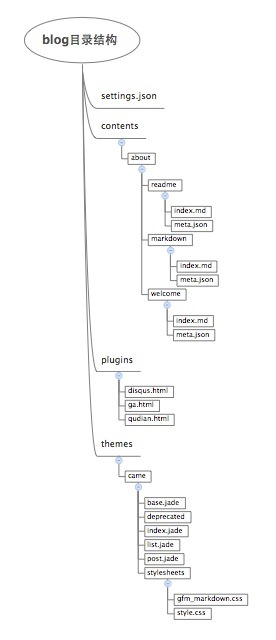

# welcome
欢迎来到你的新博客站点！这是一个用我定义的样式文件came规范的默认的模板。你也可以自己定义它的样式。

这个博客站点的目录结构如下图：

文章按照你定义的类别进行归类，你可以在添加博客的时候给出文章的所属类别。原始的博客文件在contents目录下，按照文章所属类别、固定链接地址来存放。catlog自带了三个插件disqus、ga、qudian。disqus是一款网页版的在线评论插件。ga是一款google分析工具。qudian是一款兴趣表达、兴趣索引插件。
